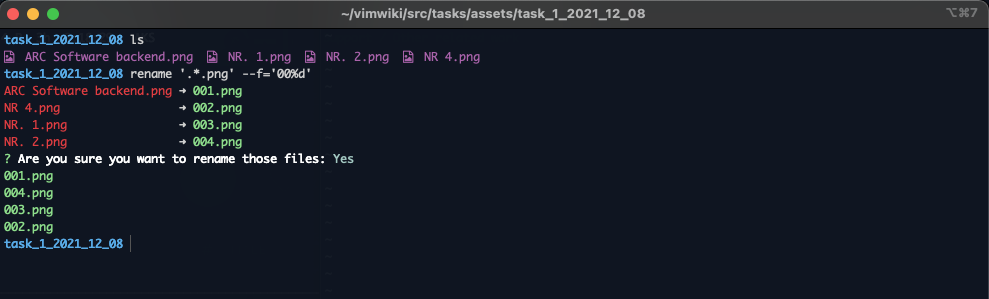

# Description

Rename the files from the current folder to sequence number file name.

# Installation

```sh
git clone https://github.com/gkssjovi/rename.git
cd rename
yarn 
chmod +x ./src/main.js
ln -s $PWD/src/main.js /usr/local/bin/rename
```

# Usage

```sh
rename '.png' -f='00%d'
```

# Example

